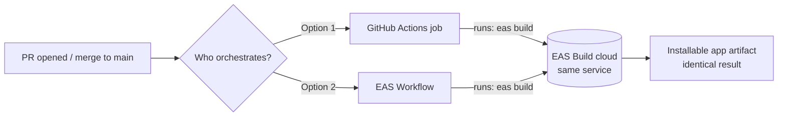
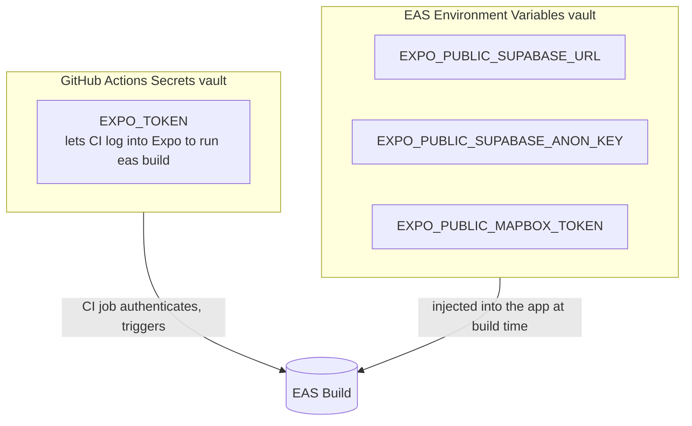

# Task 1.5 · Set up CI/CD with GitHub Actions

[Back to the epic](../01-setup-architecture.md)

## Status

- Current status: design complete — ready for execution 🟡
- Design start date: 2026-06-10
- Execution date: _pending_
- Working approach: guided learning from zero (DevOps beginner), explicit decisions before touching code, user does the hands-on implementation

## Objective

Stand up VICI's first real CI/CD foundation: an automated quality gate that runs on every pull request, plus a cloud build pipeline that can produce installable app artifacts on demand. The aim is twofold — a working pipeline **and** a from-scratch understanding of every moving part (runners, secrets, caching, EAS Build, the CI/CD split) so future automation is an extension, not a rewrite.

---

## Glossary (acronyms used in this doc)

| Term               | Expansion                      | One-line meaning                                                                                                                   |
| ------------------ | ------------------------------ | ---------------------------------------------------------------------------------------------------------------------------------- |
| **CI**             | Continuous Integration         | Robots run lint/typecheck/tests on every change so `main` never breaks.                                                            |
| **CD**             | Continuous Delivery/Deployment | Automation that builds and ships the app once code is merged.                                                                      |
| **GitHub Actions** | —                              | GitHub's built-in automation; YAML files in `.github/workflows/` react to events (PR, push, merge).                                |
| **runner**         | —                              | A fresh, empty VM GitHub spins up to execute a workflow. Nothing is installed until you install it.                                |
| **EAS**            | Expo Application Services      | Expo's cloud platform. We use **EAS Build** (compiles the app in the cloud) and later **EAS Submit** (uploads to stores).          |
| **EAS Build**      | —                              | Compiles the React Native app on Expo's cloud machines (macOS for iOS, Linux for Android). Removes the need for a local Mac/Xcode. |
| **CLI**            | Command-Line Interface         | A tool run by typing commands (e.g. `eas build`). The key to why GitHub Actions can drive EAS.                                     |
| **DORA**           | DevOps Research and Assessment | Industry metrics for delivery performance; "Deployment Frequency" is powered by the CD trigger.                                    |
| **RLS**            | Row-Level Security             | Postgres/Supabase per-row access rules that make the `anon` key safe to ship publicly.                                             |

---

## Decisions Made

### D1 — Scope: CI gates + working EAS Build, store deployment deferred

**Decision:** Task 1.5 delivers (a) a CI quality gate on every PR and (b) working EAS cloud builds that produce installable artifacts. It does **not** deploy to the App Store / Play Store.

**Why:** This is the natural "first CI/CD task." It teaches the entire CI gate plus the genuinely new mobile concept (cloud builds via EAS Build), while stopping exactly before the part that requires money (paid Apple Developer account, $99/yr) and credential bureaucracy (signing certs, store service accounts). Deployment deserves its own focused task when the app is actually release-ready.

**Deferred to a release task (Epic 07 · Deploy & Observability):**

- `eas submit` to TestFlight / Play Console
- iOS production/device builds requiring Apple signing credentials
- Store service-account setup

---

### D2 — CI engine: GitHub Actions (not EAS Workflows)

**Decision:** Use **GitHub Actions** for the CI gates. Invoke EAS Build _from_ a GitHub Actions job via the EAS CLI, rather than adopting EAS Workflows.

**Why:**

- The repo **already runs a GitHub Actions workflow** (`.github/workflows/branch-name.yml`) — extending one CI system beats running two in parallel.
- GitHub Actions is the **industry-standard, portable skill**; it looks the same on any stack. EAS Workflows knowledge only applies inside Expo.
- The lint/typecheck minutes are **free** on GitHub, whereas EAS Workflows would consume Expo plan minutes for plain Node work.
- It teaches the correct mental model: **the CI orchestrator (GitHub Actions) is separate from the build service (EAS Build) it calls.**

**Key insight that makes this possible:** EAS Build is a _service_ triggered by a single command — `eas build` — from the EAS CLI. That command runs from anywhere with the CLI + an Expo token: your laptop, an EAS Workflow, or a GitHub Actions job. The build itself always runs on Expo's cloud; only the "driver's seat" differs. So both engines reach an identical artifact — the choice is about convenience and lock-in, not capability.



**Future note:** if the team ever wants the tightest possible build orchestration and accepts Expo lock-in, EAS Workflows can be revisited. Not worth it for a skill-building, portable-first setup.

---

### D3 — `test` job deferred to Epic 08 · Testing & QA

**Decision:** `ci.yml` ships with **lint + typecheck only**. No `test` job in this task.

**Why:** There is no test runner in the repo yet (no Jest/Vitest, no test files). A test command that finds zero tests either errors (red pipeline) or passes vacuously (a green checkmark that proves nothing) — both are dishonest. Testing is a large topic with its own epic (**Epic 08**), where the runner choice (`@testing-library/react-native`), strategy, and meaningful tests deserve focused space.

**How the pipeline stays "test-ready":** the CI structure is built so adding a `test` job later is a ~5-line edit slotting in right after `typecheck`. The gate is real (lint + typecheck satisfies the epic's "basic CI pipeline" Definition of Done); only the test step is honestly deferred.

**Deferred to:** [Epic 08 · Testing & QA](../08-testing-qa.md) — add Vitest (or Jest) + `@testing-library/react-native`, write the first tests, then append a `test` job to `ci.yml`.

---

### D4 — Install/cache: single sequential job, pnpm cache, frozen lockfile

**Decision:** One CI job with sequential steps, not parallel jobs.

**Step order:**

1. `actions/checkout` — pull the code onto the runner
2. `pnpm/action-setup` — install pnpm, pinned to **10.33.2** (matches `packageManager` in root `package.json`)
3. `actions/setup-node` with `cache: 'pnpm'` — install **Node 24** and restore the pnpm download cache keyed by `pnpm-lock.yaml`
4. `pnpm install --frozen-lockfile` — install exactly the locked dependency tree
5. `pnpm lint` (→ `turbo lint`)
6. `pnpm typecheck` (→ `turbo typecheck`)

**Why:**

- **Single job** is the right default at this size: install once, then run two fast checks. Parallel jobs would double install cost and YAML to save a few seconds — premature optimization.
- **`cache: 'pnpm'`** restores downloaded packages instantly when the lockfile is unchanged — the biggest CI speed win.
- **`--frozen-lockfile`** is a correctness/security habit: CI must build from the exact locked tree and fail if `package.json` and the lockfile disagree — never silently resolve fresh (possibly poisoned) versions.
- **Pinning Node 24 / pnpm 10.33.2** makes CI reproduce the local environment exactly (repo requires Node `>=24.11.1 <25`).

**Future note:** if the pipeline grows (e.g. a slow test suite), split into parallel `lint` / `typecheck` / `test` jobs. Turbo remote caching could also be wired so cache survives across runners — an advanced extra, unnecessary now.

---

### D5 — EAS profiles: define all 3, build Android + iOS-simulator `preview` now

**Decision:** Create `eas.json` (new file) with all three conventional profiles — `development`, `preview`, `production`. In this task, actually build:

- **Android `preview`** → a real installable `.apk` (Expo auto-generates the keystore; no account needed).
- **iOS `preview` simulator build** (`ios.simulator: true`) → a `.app` that runs in the Xcode iOS Simulator on macOS (no Apple account, no signing).

**Why:** This produces _real, free, holdable artifacts_ on both platforms and teaches the full `eas.json` structure, while stopping before the Apple paywall. An iOS simulator build is free and unsigned; it just can't install on a physical iPhone (that requires the paid account + signing).

**Profile reference:**

| Profile       | Produces                             | Installs on                                        | Status in 1.5           |
| ------------- | ------------------------------------ | -------------------------------------------------- | ----------------------- |
| `development` | dev client + debug tools             | own device/simulator                               | defined, not built here |
| `preview`     | release-style, internal distribution | testers' devices (Android) / Xcode simulator (iOS) | **built now**           |
| `production`  | store-ready `.aab` / signed `.ipa`   | TestFlight / Play only                             | defined, deferred       |

**Deferred (needs paid Apple Developer account → Epic 07):** iOS device/`production` builds requiring signing certificates and provisioning profiles.

---

### D6 — Secrets: `EXPO_TOKEN` in GitHub, app config in EAS env vars

**Decision:** Match each secret to the vault that needs it, at the moment it's needed.



| Secret                          | Lives in                      | Needed by       | Notes                                                                                                                       |
| ------------------------------- | ----------------------------- | --------------- | --------------------------------------------------------------------------------------------------------------------------- |
| `EXPO_TOKEN`                    | **GitHub Actions secrets**    | the CI runner   | Lets CI authenticate to Expo to run `eas build`. The app never sees it. The only secret strictly required for the pipeline. |
| `EXPO_PUBLIC_SUPABASE_URL`      | **EAS environment variables** | the build / app | Injected at build time.                                                                                                     |
| `EXPO_PUBLIC_SUPABASE_ANON_KEY` | **EAS environment variables** | the build / app | Safe to embed — protected by RLS.                                                                                           |
| `EXPO_PUBLIC_MAPBOX_TOKEN`      | **EAS environment variables** | the build / app | Placeholder until [Epic 03 · Maps](../03-maps-geolocation.md); the _mechanism_ is what we prove now.                        |

**Why:** The cardinal rule (OWASP, epic step 4) — secrets never live in source. `EXPO_TOKEN` is a _CI credential_, so it belongs in GitHub's vault. The app's runtime config is needed _on the build machine_, so it belongs in EAS. Dumping everything in one place is the common beginner mistake.

**The `EXPO_PUBLIC_` rule:** any env var prefixed `EXPO_PUBLIC_` is **embedded into the app bundle** and extractable by anyone who downloads the app. The Supabase **anon key** and **Mapbox token** are _designed_ to be public (guarded by RLS and URL restrictions), so the prefix is correct. A truly sensitive key — the Supabase **service-role key** (bypasses RLS) — must **never** be `EXPO_PUBLIC_` and must never ship in the app; it only ever lives server-side (Edge Functions, Epic 04).

**Correction to the epic:** epic step 4 lists `SUPABASE_URL`, `SUPABASE_ANON_KEY`, and `MAPBOX_TOKEN` as "GitHub secrets." For a mobile app that's technically wrong — those are _build-time app config_ and belong in **EAS environment variables**, not GitHub. Only `EXPO_TOKEN` is a GitHub secret here.

---

### D7 — CD trigger: manual now (`workflow_dispatch`), auto-on-`main` pre-written but disabled

**Decision:** Two workflows.

1. **`ci.yml`** — trigger: `pull_request` → lint + typecheck gate (D2–D4).
2. **`build.yml`** — trigger: **`workflow_dispatch` only** (manual "Run workflow" button) → `eas build --profile preview --platform all --non-interactive --no-wait`. The `push: [main]` trigger is **written but commented out**.

```yaml
on:
  workflow_dispatch: # ✅ ACTIVE now: build only when you press "Run workflow"
  # push:            # ⏸️ Phase 2: uncomment when main is release-worthy
  #   branches: [main]
```

**Why:** Builds are slow and consume limited free EAS build quota. With trunk-based dev and many small PRs merging into `main` while the app is still pre-usable, auto-building on every merge would burn quota producing throwaway artifacts nobody installs. Manual `workflow_dispatch` means builds fire **only when you choose** — and you can still test the whole pipeline on demand during this task without merging anything. The auto-CD path is fully wired, one uncomment away.

This matches automation level to **project maturity** — a deliberate engineering judgment, not a default.

- **Phase 1 (now):** manual `workflow_dispatch`. Conserves quota during noisy early-stage merges.
- **Phase 2 (post-MVP, `main` release-worthy):** uncomment `push: [main]` to graduate to continuous deployment. This is when the DORA **Deployment Frequency** metric starts mattering.

**`--no-wait` note:** the GitHub job finishes immediately after _queuing_ the EAS build (the build continues on Expo's side), so no GitHub minutes are spent watching a build spin.

**Future note:** if the team grows and broken-after-merge builds become costly, add a build to the PR gate or a pre-merge check.

---

## Planned Execution Checklist

Ordered so each step builds on the last. **You** run each command; I guide and verify.

### Phase A — EAS account & CLI

- [ ] Create a free Expo account (if none) and verify email
- [ ] Install the EAS CLI (`pnpm add -g eas-cli`) and `eas login`
- [ ] From `apps/mobile/`, run `eas init` to link the project (creates/links an EAS project ID)

### Phase B — `eas.json` build profiles (D5)

- [ ] Create `apps/mobile/eas.json` with `development`, `preview`, `production` profiles
- [ ] Set `preview.android.buildType` to produce an installable `.apk`
- [ ] Set `preview.ios.simulator: true` for the free simulator build
- [ ] Commit `eas.json`

### Phase C — EAS environment variables (D6)

- [ ] Create `EXPO_PUBLIC_SUPABASE_URL` and `EXPO_PUBLIC_SUPABASE_ANON_KEY` as EAS env vars (real values from the Supabase project)
- [ ] Create `EXPO_PUBLIC_MAPBOX_TOKEN` as a placeholder EAS env var
- [ ] Confirm the service-role key is **not** present anywhere client-side

### Phase D — First manual cloud build (validates D5)

- [ ] `eas build --profile preview --platform android` → wait for green, download `.apk`
- [ ] `eas build --profile preview --platform ios` (simulator) → run the `.app` in the Xcode iOS Simulator
- [ ] Confirm both artifacts launch the app

### Phase E — `ci.yml` quality gate (D2–D4)

- [ ] Create `.github/workflows/ci.yml` triggered on `pull_request` to `main`
- [ ] Steps: checkout → pnpm 10.33.2 → Node 24 + `cache: 'pnpm'` → `pnpm install --frozen-lockfile` → `pnpm lint` → `pnpm typecheck`
- [ ] Open a test PR and confirm the gate runs green
- [ ] (Optional) mark the gate a required status check on `main`

### Phase F — `build.yml` manual build workflow (D7)

- [ ] Generate an `EXPO_TOKEN` (Expo dashboard → access tokens) and add it as a **GitHub Actions secret**
- [ ] Create `.github/workflows/build.yml` with `workflow_dispatch` active and `push: [main]` commented out
- [ ] Step: install EAS CLI / use `expo/expo-github-action` with the token → `eas build --profile preview --platform all --non-interactive --no-wait`
- [ ] Trigger it from the GitHub Actions tab and confirm it queues an EAS build

### Phase G — Wrap-up

- [ ] Update epic 1.5 status → Completed; check the steps that are genuinely done
- [ ] Tick "Basic CI pipeline running on every PR" in the epic Definition of Done
- [ ] Record the deferred items (test job, store submit, iOS signing) in the epic

---

## Decisions In Progress

All decisions closed. ✅

- [x] Scope of CI/CD for this task → **CI gates + EAS Build, deploy deferred (D1)**
- [x] CI engine → **GitHub Actions (D2)**
- [x] `test` job → **deferred to Epic 08 (D3)**
- [x] Install/cache shape → **single sequential job + pnpm cache + frozen lockfile (D4)**
- [x] EAS profiles & platforms → **3 profiles; build Android + iOS-sim preview (D5)**
- [x] Secrets placement → **`EXPO_TOKEN` in GitHub, app vars in EAS (D6)**
- [x] CD trigger → **manual now, auto-on-main pre-written/disabled (D7)**

---

## Senior Learning 🎓

**Week 11 — Cloud / CI-CD.** The headline concept: **CI and CD are two different jobs with two different triggers.** CI is cheap, fast, and runs constantly (every PR) to keep `main` healthy. CD is expensive and deliberate (on merge or on demand) because it produces real artifacts and consumes quota. Conflating them — e.g. building the whole app on every PR — is the classic beginner mistake that drains resources and slows feedback.

The second senior habit here is **separation of orchestrator from service**: GitHub Actions doesn't build the app, it _asks_ EAS Build to. The same pattern recurs everywhere (a CI job calling Terraform, calling Docker, calling a deploy API). Once you see CI as a thin coordinator that shells out to specialized services, the whole landscape simplifies.

Even though VICI uses EAS instead of Docker for app builds, the CI/CD _pipeline concept_ is identical to any backend: install deps → run gates → build artifact → ship. Supabase Edge Functions (Epic 04) _can_ be containerized locally with `supabase start` (Docker under the hood), which is where the container side of this learning will land.

---

## 📚 Extras — From Zero to Hero

- **Cloud and Containers (Week 11): CI vs CD.** Understand the difference between CI (continuous integration: lint + tests on every PR) and CD (continuous delivery/deployment: builds on a deliberate trigger).

  > In this task CI = `ci.yml` on every `pull_request` (lint + typecheck — fast, free, blocks bad merges). CD = `build.yml` producing an installable artifact via EAS Build. We deliberately put CD behind a **manual `workflow_dispatch`** trigger (D7) instead of auto-firing on merge, because the app is pre-MVP and trunk-based merges are frequent — auto-building each one would waste limited EAS quota on throwaway artifacts. The `push: [main]` trigger sits commented out, ready to graduate to true continuous deployment when `main` becomes release-worthy. Matching automation to project maturity _is_ the senior move.

- **Docker:** `supabase start` uses Docker internally — first practical contact with containers.

  > **Deferred to [Epic 04 · Gameplay & Running](../04-gameplay-running.md)**, where Supabase Edge Functions are introduced. Running `supabase start` locally spins up the full Supabase stack (Postgres, Auth, Storage, the API gateway) as Docker containers defined in a generated compose file. Inspecting that compose file — seeing each service, its image, and its port — is the cleanest first look at containers. It's out of scope for 1.5 because this task builds the _app_ via EAS (Expo's cloud, no local Docker), not the backend.

- **AWS/GCP Fundamentals:** EAS Build runs on cloud servers. Understand what a CI runner is, what a build artifact is, and why secrets never live in source code.

  > A **runner** is an ephemeral VM (GitHub spins up a fresh, empty Ubuntu machine per workflow run; nothing is installed until your steps install it — which is exactly why caching matters, D4). A **build artifact** is the compiled output an artifact produces — here the `.apk` / `.app` from EAS Build, downloadable and installable. **Why secrets never live in source:** anything committed enters git history permanently; a leaked `EXPO_TOKEN` lets anyone trigger builds on your Expo account, and a leaked service-role key bypasses all RLS. Hence the vault split in D6 — `EXPO_TOKEN` in GitHub's encrypted secret store (injected as an env var at runtime), app config in EAS, and the service-role key never client-side at all. EAS Build is effectively a managed cloud-build service (the same category as AWS CodeBuild / GCP Cloud Build), so this is genuine cloud-CI fundamentals, just with the servers managed for you.

- **Engineering Management (Week 15) — DORA metrics:** the CI/CD pipeline powers DORA "Deployment Frequency."

  > **DORA** (DevOps Research and Assessment) defines four delivery-performance metrics; **Deployment Frequency** — how often you ship to production — is the one this pipeline underpins. Right now it's effectively zero by design (manual builds, no store deploy — D1/D7), which is _correct_ for a pre-MVP app: you can't meaningfully measure deployment frequency before you deploy. The foundation is what matters — the moment Phase 2 flips on (`push: [main]` uncommented) plus store submission (Epic 07) lands, every merge becomes a measurable deployment and the metric starts producing real signal. Building the trigger now means the instrumentation is ready before the metric is needed.

---

## What Will Be Needed in Future Tasks

### Epic 07 — Deploy & Observability

- `eas submit` workflow to push builds to TestFlight / Play Console
- Paid Apple Developer account + iOS signing credentials (certificates, provisioning profiles)
- iOS `production` device builds
- Graduate `build.yml` to the `push: [main]` trigger (Phase 2) for continuous deployment
- Observability/crash reporting wiring to close the DORA loop

### Epic 08 — Testing & QA

- Add a test runner (Vitest or Jest) + `@testing-library/react-native`
- Write the first meaningful tests
- Append a `test` job to `ci.yml` (slots in right after `typecheck`, D3)

### Epic 03 — Maps & Geolocation

- Replace the `EXPO_PUBLIC_MAPBOX_TOKEN` placeholder with a real, URL-restricted token in EAS env vars
